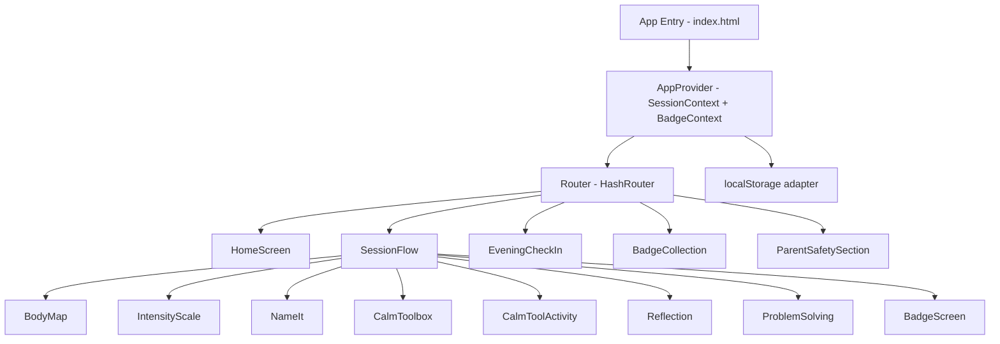
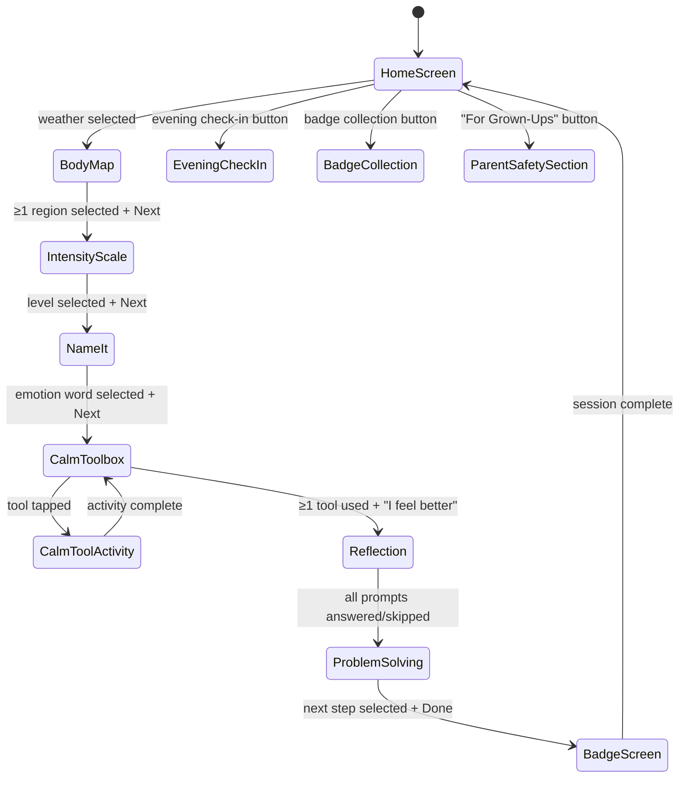

# Design Document: Feelings Explorer

## Overview

Feelings Explorer is a parent-child co-regulation responsive web app. A parent and child (ages 5–10) use it together in 5–10 minute sessions to build emotional literacy through a structured journey: weather check-in → body map → intensity scale → name the feeling → calm toolbox → reflection → problem-solving → badge reward.

The app is a pure client-side single-page application (SPA). No backend, no accounts, no network calls after initial load. All state lives in `localStorage`. It must work on iPhone (375px), iPad (~768px), and laptop (1024–1440px).

### Design Principles

- **Child-first visuals**: Large tap targets (≥44×44px), illustrated icons, minimal reading demand for children
- **Parent-aware**: Coaching scripts and "For Grown-Ups" sections are visually distinct
- **Warm illustrated aesthetic**: Rounded shapes, soft gradients, pastel palette, friendly character illustrations
- **Offline-first**: Fully functional after initial page load
- **Privacy by design**: Zero data leaves the device

### Visual Style (informed by asset mockups)

The mockups show a warm, illustrated style with:
- Soft pastel backgrounds (lavender, peach, sky blue, mint)
- Rounded card tiles with drop shadows
- Large emoji/illustration icons on each card
- A friendly child character mascot used throughout
- Weather icons rendered as large illustrated badges
- Body map as a simple front-facing child silhouette with glowing tap regions
- Volcano/thermometer metaphor for intensity scale
- Progress dots at the bottom of each session screen

---

## Architecture

The app is a vanilla HTML/CSS/JavaScript SPA (no build toolchain required for MVP, though a simple Vite setup is recommended for developer experience). No framework dependency is strictly required, but **React** (via CDN or Vite) is recommended for component reuse and state management simplicity.

### Technology Stack

| Layer | Choice | Rationale |
|---|---|---|
| UI Framework | React 18 (Vite) | Component reuse, state management, no backend needed |
| Styling | CSS Modules + CSS custom properties | Scoped styles, theming, no runtime overhead |
| State | React Context + `localStorage` | Simple, no external dependency |
| Routing | React Router v6 (hash-based) | Works offline/static, no server config needed |
| Animations | CSS keyframes + Web Animations API | No library dependency for simple transitions |
| Audio (narration) | Web Speech API (`speechSynthesis`) | Built-in, no CDN dependency |
| Testing | Vitest + fast-check | Unit + property-based testing |

### High-Level Architecture



### Session Flow (enforced order)



---

## Components and Interfaces

### Component Tree

```
App
├── AppProvider (SessionContext, BadgeContext)
├── HomeScreen
│   ├── WeatherGrid (7 × WeatherCard)
│   ├── EveningCheckInButton
│   ├── BadgeCollectionButton
│   └── ForGrownUpsButton
├── SessionFlow (route guard enforcing order)
│   ├── ProgressIndicator
│   ├── BackButton
│   ├── BodyMap
│   │   ├── BodySilhouette (SVG with tappable regions)
│   │   └── NextButton
│   ├── IntensityScale
│   │   ├── IntensityItem × 5
│   │   ├── ParentScriptPanel
│   │   └── NextButton
│   ├── NameIt
│   │   ├── EmotionWordCard × n
│   │   ├── ParentScriptPanel
│   │   ├── NoMoreLikeButton
│   │   └── NextButton
│   ├── CalmToolbox
│   │   ├── CalmToolCard × n
│   │   └── IFeelBetterButton
│   ├── CalmToolActivity
│   │   ├── BreathingGuide (animated shape)
│   │   ├── ActivityInstructions
│   │   └── DoneButton
│   ├── Reflection
│   │   ├── ReflectionPrompt × 4
│   │   ├── ResponseOptionGrid
│   │   ├── SkipButton
│   │   └── NextButton
│   ├── ProblemSolving
│   │   ├── NextStepTile × 9
│   │   └── DoneButton
│   └── BadgeScreen
│       ├── BadgeAwardAnimation
│       └── HomeButton
├── EveningCheckIn
│   ├── EveningPrompt × 4
│   └── ClosingMessage
├── BadgeCollection
│   └── BadgeTile × n
└── ParentSafetySection
    ├── AdultConfirmGate
    └── SafetyContent
```

### Key Component Interfaces (TypeScript)

```typescript
// Session state shape
interface SessionState {
  weatherMetaphor: WeatherMetaphor | null;
  bodyRegions: BodyRegion[];
  intensityLevel: 1 | 2 | 3 | 4 | 5 | null;
  selectedEmotion: string | null;
  calmToolsUsed: string[];
  reflectionResponses: Record<number, string[]>;
  nextStep: string | null;
  currentStep: SessionStep;
}

// Badge state shape
interface BadgeState {
  earned: BadgeType[];
}

// Weather metaphor enum
type WeatherMetaphor =
  | 'sunny' | 'rainy' | 'stormy' | 'foggy'
  | 'windy' | 'sparkly' | 'heavy-clouds';

// Body regions
type BodyRegion = 'head' | 'throat' | 'chest' | 'tummy' | 'hands' | 'legs';

// Session steps (enforced order)
type SessionStep =
  | 'home' | 'body-map' | 'intensity' | 'name-it'
  | 'calm-toolbox' | 'calm-activity' | 'reflection'
  | 'problem-solving' | 'badge-screen';

// Badge types
type BadgeType =
  | 'feeling-detective' | 'brave-breather' | 'repair-hero'
  | 'body-signal-spotter' | 'kind-words-champion' | 'try-again-star';

// Calm tool
interface CalmTool {
  id: string;
  label: string;
  category: 'breathing' | 'body' | 'sensory' | 'connection';
  instruction: string;
  hasBreathingGuide: boolean;
}

// Emotion word card
interface EmotionWord {
  label: string;
  emoji: string;
  family: WeatherMetaphor;
}
```

### ParentScriptPanel

Displayed alongside child-facing content when intensity ≥ 4 or an emotion word is selected. Visually distinct: warm amber/cream background, "For Grown-Ups 👋" label, slightly smaller font. Default message shown when no trigger is active.

---

## Data Models

### localStorage Schema

All data is stored under a single namespace key `feelings-explorer` as a JSON object:

```typescript
interface StoredData {
  version: 1;
  currentSession: SessionState | null;
  badgeCollection: BadgeType[];
  eveningCheckIns: EveningCheckInRecord[];
}

interface EveningCheckInRecord {
  date: string; // ISO date string YYYY-MM-DD
  responses: {
    feeling: string | null;
    intensity: number | null;
    whatHelped: string | null;
    proudOf: string | null;
  };
}
```

### Static Data (bundled in app)

#### Weather → Emotion Family Mapping

```typescript
const WEATHER_EMOTION_MAP: Record<WeatherMetaphor, string[]> = {
  sunny:         ['Happy', 'Proud', 'Excited', 'Grateful', 'Joyful'],
  rainy:         ['Sad', 'Lonely', 'Disappointed', 'Hurt', 'Left Out'],
  stormy:        ['Angry', 'Frustrated', 'Annoyed', 'Jealous', 'Treated Unfairly', 'Left Out'],
  foggy:         ['Confused', 'Unsure', 'Overwhelmed', 'Lost'],
  windy:         ['Worried', 'Nervous', 'Scared', 'Anxious', 'Unsure'],
  sparkly:       ['Silly', 'Playful', 'Energetic', 'Giddy', 'Excited'],
  'heavy-clouds':['Tired', 'Overwhelmed', 'Drained', 'Heavy', 'Bored'],
};
```

#### Parent Scripts

```typescript
const PARENT_SCRIPTS: Record<WeatherMetaphor, string> = {
  stormy:        "You're really angry. I won't let you hit, but I will help you.",
  rainy:         "That felt really disappointing. I'm here with you.",
  windy:         "Your brain is trying to keep you safe. Let's check: is this a real danger or a worry thought?",
  foggy:         "You made a mistake. You are not bad. We can fix this.",
  sunny:         "I love seeing you feel this way. Tell me more!",
  sparkly:       "You've got so much energy right now! Let's use it.",
  'heavy-clouds':"It sounds like your body needs some rest. Let's go gently.",
};

const DEFAULT_PARENT_SCRIPT = "Follow your child's lead. Stay calm and curious.";
```

#### Intensity Scale Labels

```typescript
const INTENSITY_LABELS: Record<number, string> = {
  1: 'Tiny feeling',
  2: 'Growing feeling',
  3: 'Big feeling',
  4: 'Too big',
  5: 'Eruption / meltdown',
};
```

#### Badge Earning Conditions

```typescript
const BADGE_CONDITIONS: Record<BadgeType, (session: SessionState) => boolean> = {
  'feeling-detective':    (s) => s.selectedEmotion !== null,
  'brave-breather':       (s) => s.calmToolsUsed.some(id => CALM_TOOLS[id]?.category === 'breathing'),
  'repair-hero':          (s) => s.nextStep === 'Repair / Say Sorry',
  'body-signal-spotter':  (s) => s.bodyRegions.length >= 1,
  'kind-words-champion':  (s) => s.calmToolsUsed.some(id => CALM_TOOLS[id]?.category === 'connection'),
  'try-again-star':       (s) => s.nextStep === 'Try Again',
};
```

### Session Flow Guard

The `SessionFlow` component enforces step ordering. Each route checks that all prerequisite steps are complete before rendering; if not, it redirects to the earliest incomplete step.

```typescript
const STEP_ORDER: SessionStep[] = [
  'home', 'body-map', 'intensity', 'name-it',
  'calm-toolbox', 'reflection', 'problem-solving', 'badge-screen'
];

function isStepUnlocked(step: SessionStep, session: SessionState): boolean {
  switch (step) {
    case 'body-map':       return session.weatherMetaphor !== null;
    case 'intensity':      return session.bodyRegions.length >= 1;
    case 'name-it':        return session.intensityLevel !== null;
    case 'calm-toolbox':   return session.selectedEmotion !== null;
    case 'reflection':     return session.calmToolsUsed.length >= 1;
    case 'problem-solving':return true; // reached after reflection (even if skipped)
    case 'badge-screen':   return session.nextStep !== null;
    default:               return true;
  }
}
```

---

## Correctness Properties

*A property is a characteristic or behavior that should hold true across all valid executions of a system — essentially, a formal statement about what the system should do. Properties serve as the bridge between human-readable specifications and machine-verifiable correctness guarantees.*

### Property 1: Weather-to-emotion-family mapping is total and consistent

*For any* valid `WeatherMetaphor` value, `WEATHER_EMOTION_MAP[weather]` SHALL return a non-empty array of emotion strings, and every emotion string in that array SHALL be a non-empty string.

**Validates: Requirements 1.4, 4.2**

### Property 2: Session step unlock is monotone

*For any* session state `s` and step `step`, if `isStepUnlocked(step, s)` returns `true`, then adding more data to `s` (selecting more body regions, choosing an emotion, etc.) SHALL NOT cause `isStepUnlocked(step, s')` to return `false`.

**Validates: Requirements 14.1, 14.2, 14.3**

### Property 3: Badge conditions are non-overlapping and deterministic

*For any* completed session state, evaluating all badge conditions SHALL produce a deterministic set of earned badges — running the evaluation twice on the same state SHALL yield the same result.

**Validates: Requirements 9.1, 9.2**

### Property 4: localStorage round-trip preserves session state

*For any* valid `SessionState` object, serializing it to JSON and deserializing it back SHALL produce an object that is deeply equal to the original.

**Validates: Requirements 13.1, 14.5**

### Property 5: Intensity guidance message is shown iff level ≥ 4

*For any* intensity level `n` in {1, 2, 3, 4, 5}, the guidance message "Your feeling is a [level]…" SHALL be displayed if and only if `n >= 4`.

**Validates: Requirements 3.5, 3.6**

### Property 6: Calm tool used list is append-only within a session

*For any* session, the list of calm tools used SHALL only grow — using a calm tool SHALL add it to the list and SHALL NOT remove any previously used tool.

**Validates: Requirements 5.7, 5.9**

### Property 7: Badge collection persists across sessions

*For any* set of badges earned in session A, after the session is saved to localStorage and a new session B is started, the badges from session A SHALL still appear in the badge collection.

**Validates: Requirements 9.4, 9.5**

### Property 8: Parent script panel shows correct script for weather family

*For any* `WeatherMetaphor`, `PARENT_SCRIPTS[weather]` SHALL return a non-empty string, and when the weather is active in a session, the parent script panel SHALL display exactly that string.

**Validates: Requirements 6.1, 6.2**

---

## Error Handling

### localStorage Unavailable

Some browsers (private mode, storage quota exceeded) may throw when accessing `localStorage`. The app SHALL:
1. Wrap all `localStorage` calls in try/catch
2. Fall back to in-memory state for the session if storage is unavailable
3. Display a non-blocking banner: "Your progress won't be saved on this device"

### Invalid/Corrupted localStorage Data

On app load, the stored JSON is validated against the expected schema. If validation fails:
1. Log a warning to the console
2. Reset to a clean initial state
3. Optionally show a one-time notice: "We couldn't load your previous data"

### Web Speech API Unavailable

If `window.speechSynthesis` is not available:
1. Hide the speaker icon rather than showing a broken button
2. No error is shown — narration is an enhancement, not a core requirement

### Navigation Guard Violations

If a user manually navigates to a locked route (e.g., via URL hash):
1. The `SessionFlow` guard redirects to the earliest unlocked step
2. No error screen is shown — the redirect is silent and immediate

### "Clear All Data" Confirmation

The destructive action requires a two-step confirmation:
1. First tap: show a confirmation dialog ("Are you sure? This will delete all badges and session history.")
2. Second tap (confirm): delete all localStorage data and navigate to HomeScreen
3. Cancel: dismiss dialog, no data deleted

---

## Testing Strategy

### Dual Testing Approach

This feature uses both unit/example-based tests and property-based tests.

**Unit tests** cover:
- Specific rendering examples (HomeScreen shows 7 weather cards)
- Edge cases (empty emotion word list, corrupted localStorage)
- Integration points (SessionContext updates propagate to child components)
- Navigation guard redirects

**Property-based tests** cover:
- Data mapping correctness (weather → emotions, badge conditions)
- State serialization round-trips
- Session flow invariants

### Property-Based Testing

Library: **fast-check** (TypeScript-native, works with Vitest)

Each property test runs a minimum of **100 iterations**.

Tag format: `// Feature: feelings-explorer, Property N: <property text>`

#### Property Test Implementations

**Property 1 — Weather-to-emotion-family mapping**
```
// Feature: feelings-explorer, Property 1: weather-emotion mapping is total
fc.assert(fc.property(
  fc.constantFrom(...ALL_WEATHER_METAPHORS),
  (weather) => {
    const emotions = WEATHER_EMOTION_MAP[weather];
    return Array.isArray(emotions) && emotions.length > 0 &&
           emotions.every(e => typeof e === 'string' && e.length > 0);
  }
), { numRuns: 100 });
```

**Property 2 — Step unlock is monotone**
```
// Feature: feelings-explorer, Property 2: step unlock is monotone
fc.assert(fc.property(
  arbitrarySessionState(),
  arbitrarySessionStep(),
  (state, step) => {
    const before = isStepUnlocked(step, state);
    const enriched = addMoreData(state); // adds body regions, emotion, etc.
    const after = isStepUnlocked(step, enriched);
    return !before || after; // if unlocked before, must still be unlocked after
  }
), { numRuns: 200 });
```

**Property 3 — Badge conditions are deterministic**
```
// Feature: feelings-explorer, Property 3: badge evaluation is deterministic
fc.assert(fc.property(
  arbitraryCompletedSession(),
  (session) => {
    const first = evaluateBadges(session);
    const second = evaluateBadges(session);
    return JSON.stringify(first.sort()) === JSON.stringify(second.sort());
  }
), { numRuns: 100 });
```

**Property 4 — localStorage round-trip**
```
// Feature: feelings-explorer, Property 4: session state round-trips through JSON
fc.assert(fc.property(
  arbitrarySessionState(),
  (state) => {
    const serialized = JSON.stringify(state);
    const deserialized = JSON.parse(serialized);
    return deepEqual(state, deserialized);
  }
), { numRuns: 100 });
```

**Property 5 — Intensity guidance shown iff level ≥ 4**
```
// Feature: feelings-explorer, Property 5: intensity guidance shown iff level >= 4
fc.assert(fc.property(
  fc.integer({ min: 1, max: 5 }),
  (level) => {
    const shown = shouldShowIntensityGuidance(level);
    return shown === (level >= 4);
  }
), { numRuns: 100 });
```

**Property 6 — Calm tool list is append-only**
```
// Feature: feelings-explorer, Property 6: calm tool list is append-only
fc.assert(fc.property(
  arbitrarySessionState(),
  fc.string({ minLength: 1 }),
  (state, toolId) => {
    const before = [...state.calmToolsUsed];
    const after = addCalmTool(state, toolId).calmToolsUsed;
    return before.every(id => after.includes(id)) && after.length >= before.length;
  }
), { numRuns: 100 });
```

**Property 7 — Badge collection persists**
```
// Feature: feelings-explorer, Property 7: badges persist across sessions
fc.assert(fc.property(
  fc.array(fc.constantFrom(...ALL_BADGE_TYPES), { minLength: 1 }),
  (badges) => {
    saveBadgesToStorage(badges);
    const loaded = loadBadgesFromStorage();
    return badges.every(b => loaded.includes(b));
  }
), { numRuns: 100 });
```

**Property 8 — Parent script panel correctness**
```
// Feature: feelings-explorer, Property 8: parent script is non-empty for all weather
fc.assert(fc.property(
  fc.constantFrom(...ALL_WEATHER_METAPHORS),
  (weather) => {
    const script = PARENT_SCRIPTS[weather];
    return typeof script === 'string' && script.length > 0;
  }
), { numRuns: 100 });
```

### Unit Test Coverage Targets

| Area | Test Type | Examples |
|---|---|---|
| HomeScreen renders 7 weather cards | Example | Snapshot + count assertion |
| Body map toggles regions on/off | Example | Tap region → highlighted; tap again → deselected |
| Next button disabled until prerequisite met | Example | No region selected → Next disabled |
| Intensity 4/5 shows parent script | Example | Select level 4 → script panel visible |
| "No, it's more like…" clears selection | Example | Select emotion → click → selection cleared |
| Calm tool activity completes and returns | Example | Complete breathing guide → back to toolbox |
| Reflection skip advances prompt | Example | Skip → next prompt shown |
| "Clear All Data" two-step confirmation | Example | First tap → dialog; cancel → data intact |
| localStorage unavailable fallback | Edge case | Mock storage throw → in-memory session works |
| Corrupted localStorage resets cleanly | Edge case | Invalid JSON → clean state, no crash |
| Voice narration hidden when unavailable | Edge case | No speechSynthesis → speaker icon absent |

### Responsive Layout Testing

Manual testing checklist:
- 375px (iPhone SE): no horizontal scroll, all tap targets ≥ 44px
- 768px (iPad): two-column layout where applicable
- 1280px (laptop): centered max-width container, comfortable reading width

### Accessibility Testing

- Colour contrast: automated check with axe-core in Vitest
- Touch targets: automated check (computed style ≥ 44×44px)
- Voice narration: manual test on Chrome, Safari, Firefox
